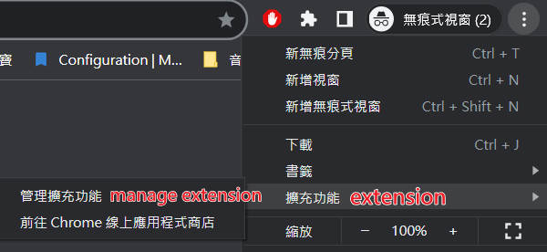
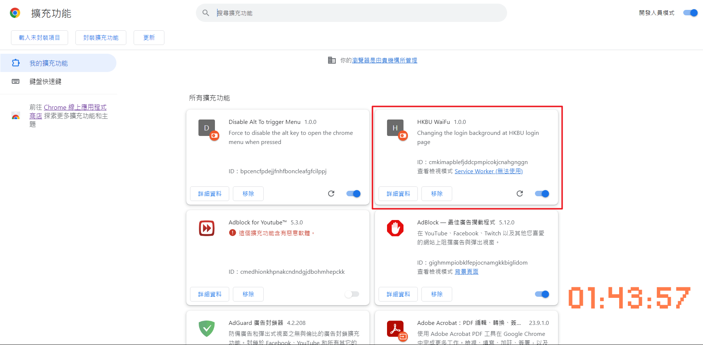

🌏 **[English](README.md)** | 繁體中文

# HKBU登入介面替換插件

~~個人看那個普通的登入介面不順眼, 所以寫了個插件更換~~ \
因為主頁的登入頁面改不了, 所以我改到了個人版面

---
_**這個插件是做什麼的**_: 
- 從[konachan.net](https://konachan.net/post)裡, 隨機拿一個二次元老婆替換
- 隨機的照片我已設定成安全模式(無Ecchi/エロ)

<h2>安裝教學</h2>

1. 下載ZIP \
[**按我下載**](https://github.com/thc282/HKBUWaifuLoginBg/releases/download/v1.0.2/HKBUAnimeBg.zip) 或 [**按這裡到下載頁面**](https://github.com/thc282/HKBUWaifuLoginBg/releases)
2. 打開chrome/edge的選單 > 擴充功能 > 管理擴充功能

3. 開啟"開發人員模式", 然后直接把剛下載的zip拉進去
4. 如下圖出現擴充功能, 就代表成功安裝

TODO:
---
- [ ] 加入自定義搜尋tag
- [ ] 加速圖片載入速度
